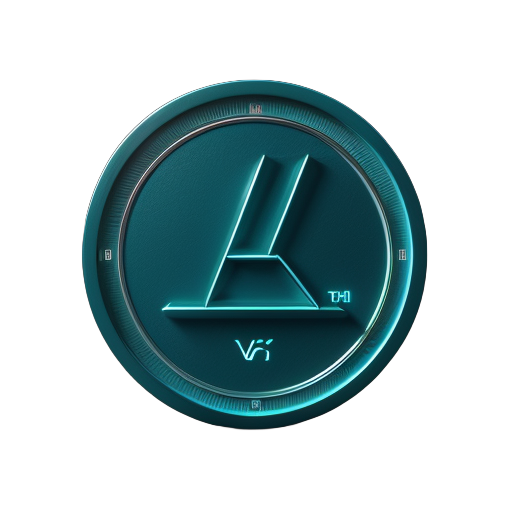

<p align="center">
  
</p>

<h1 align="center">Verix Token System</h1>

<p align="center">
  <strong>Blockchain-Powered Asset Management with Gas Fee Optimization</strong>
</p>

<p align="center">
  <a href="#overview">Overview</a> •
  <a href="#architecture">Architecture</a> •
  <a href="#features">Features</a> •
  <a href="#getting-started">Getting Started</a> •
  <a href="#documentation">Documentation</a> •
  <a href="#contributing">Contributing</a> •
  <a href="#license">License</a>
</p>

## Overview

Verix is a comprehensive token system built on the Polygon network that revolutionizes industrial asset management through blockchain technology. By combining innovative gas fee optimization with immutable asset service records, Verix creates a seamless solution for businesses to manage their physical assets while minimizing blockchain transaction costs.

### Ecosystem Overview


## Features

- **Gas Fee Optimization**
  - Tiered coverage system (50%, 75%, 100%)
  - Automated tier adjustment
  - Real-time gas price oracle integration

- **Asset Management**
  - Automated smart contract deployment
  - Digital service record creation
  - Warranty compliance tracking
  - Value preservation mechanisms

### Asset Management Workflow


## Architecture

### Gas Fee Coverage Flow


### Governance Process


## Getting Started

### Prerequisites
- Node.js v14+
- Hardhat
- MetaMask wallet
- MATIC tokens for deployment

### Installation
```bash
# Clone the repository
git clone https://github.com/verix/token-system.git

# Install dependencies
cd token-system
npm install

# Configure environment
cp .env.example .env
# Edit .env with your configuration

# Compile contracts
npx hardhat compile

# Run tests
npx hardhat test
```

## Documentation

- [Technical Documentation](docs/technical/)
- [API Reference](docs/api/)
- [Integration Guide](docs/guides/integration.md)
- [Security Considerations](docs/guides/security.md)

## Contributing

We welcome contributions to the Verix ecosystem! Please read our [Contributing Guidelines](CONTRIBUTING.md) before submitting pull requests.

### Development setup
```bash
# Fork the repository
# Clone your fork
git clone https://github.com/YOUR_USERNAME/token-system.git

# Create a feature branch
git checkout -b feature/your-feature-name

# Push changes to your fork
git push origin feature/your-feature-name
```

## License

This project is licensed under the MIT License - see the [LICENSE](LICENSE) file for details.

## Contact

- Website: https://verix.io
- Email: support@verix.io
- Twitter: [@VerixToken](https://twitter.com/VerixToken)
- Telegram: [Verix Community](https://t.me/VerixCommunity)

---
<p align="center">
  Made with ❤️ by the Verix Team
</p>
