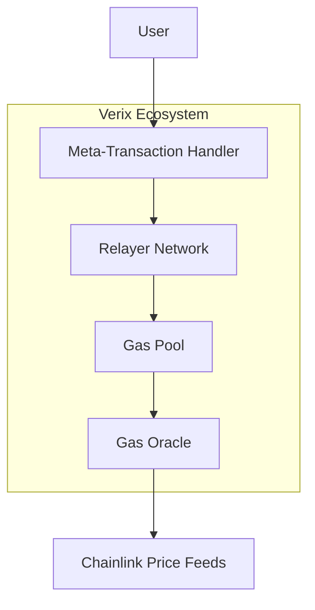

# Verix Gas Relayer System Documentation

## Table of Contents
1. [System Overview](#system-overview)
2. [Architecture](#architecture)
3. [Smart Contracts](#smart-contracts)
4. [Setup Guide](#setup-guide)
5. [Relayer Operations](#relayer-operations)
6. [Security Considerations](#security-considerations)
7. [Monitoring & Maintenance](#monitoring--maintenance)
8. [Troubleshooting](#troubleshooting)

## 1. System Overview

### Purpose
The Verix Gas Relayer System enables gasless transactions for Verix token holders on the Polygon network by covering MATIC gas fees based on user tier levels and holdings.

### Key Features
- Tiered gas coverage (50%, 75%, 100%)
- Decentralized relayer network
- Real-time gas price oracle integration
- Meta-transaction support
- Automated monitoring and maintenance

### System Components
1. Gas Pool Contract
2. Relayer Network
3. Oracle System
4. Meta-Transaction Handler
5. Monitoring Tools

## 2. Architecture

### Component Interaction Flow


### Data Flow
1. User initiates transaction
2. Meta-transaction handler processes request
3. Relayer validates and executes
4. Gas Pool covers fees
5. Oracle provides price data

## 3. Smart Contracts

### VerixGasOracle
```solidity
interface IVerixGasOracle {
    function updatePrices() external;
    function calculateGasCost(uint256 gasAmount) external view returns (uint256);
    function maticToUsd(uint256 maticAmount) external view returns (uint256);
}
```

#### Key Functions
- `updatePrices()`: Updates MATIC/USD and gas prices
- `calculateGasCost()`: Calculates gas costs in MATIC
- `maticToUsd()`: Converts MATIC amounts to USD

### VerixRelayer
```solidity
interface IVerixRelayer {
    function registerRelayer() external payable;
    function executeRelay(RelayRequest calldata request) external returns (bool);
    function topUpRelayer() external payable;
    function withdrawRelayerBalance(uint256 amount) external;
}
```

#### Key Functions
- `registerRelayer()`: Registers new relayer
- `executeRelay()`: Processes relay requests
- `topUpRelayer()`: Adds funds to relayer balance
- `withdrawRelayerBalance()`: Withdraws relayer funds

## 4. Setup Guide

### Prerequisites
- Node.js v14+
- Hardhat
- MetaMask wallet
- MATIC tokens for initial setup

### Installation Steps
1. Clone repository:
```bash
git clone https://github.com/verix/gas-relayer-system
cd gas-relayer-system
npm install
```

2. Configure environment:
```bash
cp .env.example .env
# Edit .env with your configuration
```

3. Deploy contracts:
```bash
npx hardhat run scripts/deploy.js --network polygon
```

### Configuration Parameters
```javascript
{
  "minRelayerBalance": "1000000000000000000", // 1 MATIC
  "relayerTimeout": "86400", // 24 hours
  "gasOracleUpdate": "300", // 5 minutes
  "tierThresholds": {
    "basic": "1000000000000000000000", // 1000 VRX
    "standard": "5000000000000000000000", // 5000 VRX
    "premium": "10000000000000000000000" // 10000 VRX
  }
}
```

## 5. Relayer Operations

### Becoming a Relayer
1. Meet minimum balance requirement
2. Call `registerRelayer()`
3. Monitor transaction queue
4. Maintain active status

### Relayer Responsibilities
- Monitor gas prices
- Execute transactions promptly
- Maintain minimum balance
- Update status regularly

### Monitoring Dashboard
```javascript
interface RelayerDashboard {
    activeRelayers: number;
    totalTransactions: number;
    averageResponseTime: number;
    currentGasPrice: BigNumber;
    poolBalance: BigNumber;
}
```

## 6. Security Considerations

### Smart Contract Security
- Multi-signature controls
- Rate limiting
- Balance checks
- Signature verification
- Nonce management

### Operational Security
- Private key management
- Network security
- Monitoring systems
- Backup relayers

### Best Practices
1. Regular security audits
2. Update frequency monitoring
3. Balance management
4. Emergency response plan

## 7. Monitoring & Maintenance

### Monitoring Metrics
1. Transaction Success Rate
2. Response Time
3. Gas Price Accuracy
4. Relayer Health
5. Pool Balance

### Maintenance Tasks
1. Daily
   - Monitor gas prices
   - Check relayer balances
   - Verify transaction success

2. Weekly
   - Analyze performance metrics
   - Review relayer distribution
   - Update price feeds

3. Monthly
   - Security audit
   - Performance optimization
   - System upgrades

### Alert System
```javascript
enum AlertLevel {
    INFO,
    WARNING,
    CRITICAL
}

interface Alert {
    level: AlertLevel;
    message: string;
    timestamp: number;
    action: string;
}
```

## 8. Troubleshooting

### Common Issues

#### 1. Transaction Failures
```javascript
// Check transaction status
async function checkTxStatus(txHash) {
    const tx = await provider.getTransaction(txHash);
    const receipt = await provider.getTransactionReceipt(txHash);
    return {
        status: receipt.status,
        gasUsed: receipt.gasUsed,
        effectiveGasPrice: receipt.effectiveGasPrice
    };
}
```

#### 2. Relayer Issues
- Insufficient balance
- Network congestion
- Invalid signatures
- Nonce mismatch

### Resolution Steps
1. Check system status
2. Verify transaction parameters
3. Validate signatures
4. Review gas prices
5. Check relayer status

### Emergency Procedures
1. Pause system
2. Contact administrators
3. Review logs
4. Implement fixes
5. Resume operations

## API Reference

### Gas Pool Contract
```typescript
interface GasPoolAPI {
    // User functions
    calculateCoverage(address: string): Promise<Coverage>;
    requestGas(amount: BigNumber): Promise<boolean>;
    
    // Admin functions
    updateTiers(tiers: Tier[]): Promise<void>;
    replenishPool(amount: BigNumber): Promise<void>;
    
    // View functions
    getPoolBalance(): Promise<BigNumber>;
    getUserTier(address: string): Promise<number>;
}
```

### Relayer Network
```typescript
interface RelayerAPI {
    // Relayer functions
    register(): Promise<boolean>;
    executeRelay(request: RelayRequest): Promise<boolean>;
    withdraw(amount: BigNumber): Promise<boolean>;
    
    // Admin functions
    removeRelayer(address: string): Promise<void>;
    updateParameters(params: RelayerParams): Promise<void>;
}
```

For support or additional information, contact the Verix team or visit our documentation portal.
