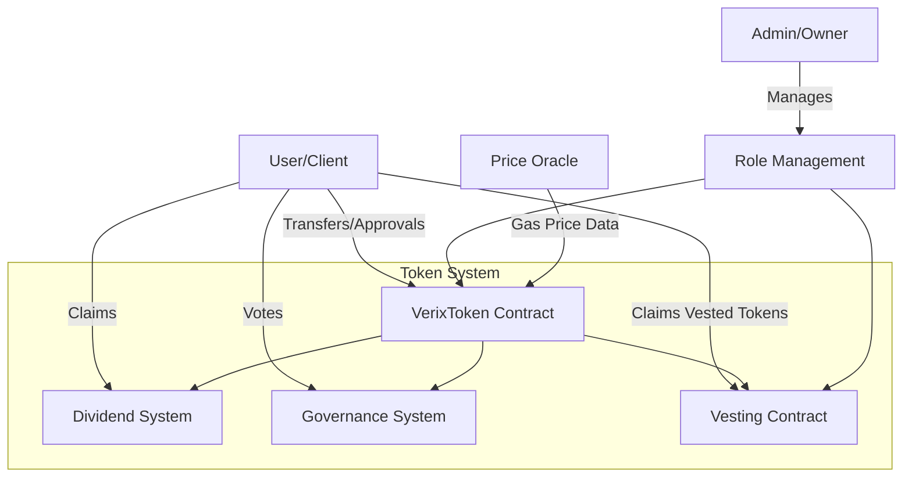
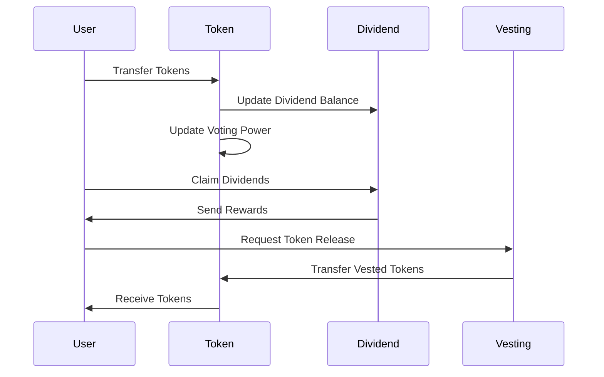

# Verix Token System - Extended Documentation

## System Architecture

### Component Interaction Diagram


### Data Flow Diagram


## Implementation Examples

### 1. Token Transfers and Dividend Claims

```typescript
// Frontend Integration Example
class VerixTokenManager {
    private contract: Contract;
    private signer: Signer;
    
    async transfer(to: string, amount: BigNumber): Promise<TransactionResponse> {
        try {
            // Convert amount to wei
            const amountWei = ethers.utils.parseEther(amount.toString());
            
            // Estimate gas
            const gasEstimate = await this.contract.estimateGas.transfer(to, amountWei);
            
            // Execute transfer with gas limit buffer
            const tx = await this.contract.transfer(to, amountWei, {
                gasLimit: gasEstimate.mul(120).div(100) // 20% buffer
            });
            
            await tx.wait();
            return tx;
        } catch (error) {
            console.error('Transfer failed:', error);
            throw error;
        }
    }
    
    async claimDividends(): Promise<TransactionResponse> {
        try {
            // Check unclaimed dividends
            const unclaimed = await this.contract.unclaimedDividends(
                await this.signer.getAddress()
            );
            
            if (unclaimed.eq(0)) {
                throw new Error('No dividends to claim');
            }
            
            // Execute claim
            const tx = await this.contract.claimDividends();
            await tx.wait();
            return tx;
        } catch (error) {
            console.error('Dividend claim failed:', error);
            throw error;
        }
    }
}
```

### 2. Governance Implementation

```typescript
// Governance Interaction Example
class VerixGovernance {
    private contract: Contract;
    
    async createProposal(proposal: string): Promise<number> {
        try {
            // Create proposal hash
            const proposalHash = ethers.utils.keccak256(
                ethers.utils.toUtf8Bytes(proposal)
            );
            
            // Submit proposal
            const tx = await this.contract.createProposal(proposalHash);
            const receipt = await tx.wait();
            
            // Get proposal ID from event
            const event = receipt.events?.find(
                e => e.event === 'ProposalCreated'
            );
            return event?.args?.proposalId.toNumber();
        } catch (error) {
            console.error('Proposal creation failed:', error);
            throw error;
        }
    }
    
    async castVote(proposalId: number, support: boolean): Promise<void> {
        try {
            // Verify voting eligibility
            const canVote = await this._canVote(proposalId);
            if (!canVote) {
                throw new Error('Cannot vote on this proposal');
            }
            
            // Submit vote
            const tx = await this.contract.castVote(proposalId, support);
            await tx.wait();
        } catch (error) {
            console.error('Vote casting failed:', error);
            throw error;
        }
    }
    
    private async _canVote(proposalId: number): Promise<boolean> {
        const proposal = await this.contract.proposals(proposalId);
        const currentTime = Math.floor(Date.now() / 1000);
        return currentTime <= proposal.startTime + 3 * 24 * 3600; // 3 days
    }
}
```

### 3. Vesting Schedule Management

```typescript
// Vesting Management Example
class VerixVesting {
    private contract: Contract;
    
    async createVestingSchedule(params: {
        beneficiary: string;
        amount: BigNumber;
        startTime: number;
        cliffDuration: number;
        duration: number;
        revocable: boolean;
    }): Promise<void> {
        try {
            // Validate parameters
            this._validateVestingParams(params);
            
            // Create schedule
            const tx = await this.contract.createVestingSchedule(
                params.beneficiary,
                params.amount,
                params.startTime,
                params.cliffDuration,
                params.duration,
                params.revocable
            );
            
            await tx.wait();
        } catch (error) {
            console.error('Vesting schedule creation failed:', error);
            throw error;
        }
    }
    
    private _validateVestingParams(params: any): void {
        if (params.cliffDuration >= params.duration) {
            throw new Error('Cliff duration must be less than total duration');
        }
        if (params.startTime < Math.floor(Date.now() / 1000)) {
            throw new Error('Start time must be in the future');
        }
    }
}
```

## Enhanced Security Considerations

### 1. Access Control Vulnerabilities

```solidity
// Secure Role Management Example
contract SecureRoleManager {
    // Role separation
    bytes32 private constant OPERATOR_ROLE = keccak256("OPERATOR_ROLE");
    bytes32 private constant ADMIN_ROLE = keccak256("ADMIN_ROLE");
    
    // Role requirements
    modifier onlyOperator() {
        require(hasRole(OPERATOR_ROLE, msg.sender), "Not operator");
        _;
    }
    
    // Two-step role transfer
    mapping(bytes32 => address) private _pendingRoleTransfers;
    
    function initiateRoleTransfer(bytes32 role, address newAdmin) 
        external 
        onlyRole(DEFAULT_ADMIN_ROLE) 
    {
        require(newAdmin != address(0), "Invalid address");
        _pendingRoleTransfers[role] = newAdmin;
        emit RoleTransferInitiated(role, newAdmin);
    }
    
    function acceptRoleTransfer(bytes32 role) external {
        require(_pendingRoleTransfers[role] == msg.sender, "Not pending admin");
        grantRole(role, msg.sender);
        _pendingRoleTransfers[role] = address(0);
        emit RoleTransferCompleted(role, msg.sender);
    }
}
```

### 2. Dividend Distribution Security

```solidity
// Secure Dividend Distribution
contract SecureDividendDistribution {
    // Prevent dividend manipulation
    mapping(address => uint256) private _lastDividendClaim;
    uint256 private constant CLAIM_COOLDOWN = 1 hours;
    
    function claimDividends() external nonReentrant {
        require(
            block.timestamp >= _lastDividendClaim[msg.sender] + CLAIM_COOLDOWN,
            "Claim too frequent"
        );
        
        uint256 amount = _calculateDividends(msg.sender);
        require(amount > 0, "No dividends");
        
        _lastDividendClaim[msg.sender] = block.timestamp;
        
        // Use pull pattern for safety
        _pendingDividends[msg.sender] = amount;
        emit DividendsReady(msg.sender, amount);
    }
    
    function withdrawDividends() external nonReentrant {
        uint256 amount = _pendingDividends[msg.sender];
        require(amount > 0, "No pending dividends");
        
        _pendingDividends[msg.sender] = 0;
        
        (bool success, ) = msg.sender.call{value: amount}("");
        require(success, "Transfer failed");
    }
}
```

### 3. Flash Loan Attack Prevention

```solidity
// Flash Loan Protection
contract FlashLoanProtected {
    // Snapshot mechanism for voting
    mapping(address => uint256) private _lastTokenBalance;
    mapping(address => uint256) private _balanceUpdateBlock;
    
    function _beforeTokenTransfer(
        address from,
        address to,
        uint256 amount
    ) internal virtual override {
        super._beforeTokenTransfer(from, to, amount);
        
        // Update balance snapshots
        _lastTokenBalance[from] = balanceOf(from);
        _lastTokenBalance[to] = balanceOf(to);
        _balanceUpdateBlock[from] = block.number;
        _balanceUpdateBlock[to] = block.number;
    }
    
    function _getVotingPower(address account) internal view returns (uint256) {
        // Use historical balance if current block
        if (_balanceUpdateBlock[account] == block.number) {
            return _lastTokenBalance[account];
        }
        return balanceOf(account);
    }
}
```

### 4. Governance Attack Prevention

```solidity
contract SecureGovernance {
    // Prevent vote manipulation
    mapping(uint256 => mapping(address => uint256)) private _voteLocks;
    
    function castVote(uint256 proposalId, bool support) external {
        require(_voteLocks[proposalId][msg.sender] == 0, "Vote locked");
        
        uint256 votingPower = _getVotingPower(msg.sender);
        require(votingPower > 0, "No voting power");
        
        // Lock voting power
        _voteLocks[proposalId][msg.sender] = votingPower;
        
        // Record vote
        _castVote(proposalId, support, votingPower);
    }
    
    // Time-weighted voting
    function _getVotingPower(address account) internal view returns (uint256) {
        uint256 balance = balanceOf(account);
        uint256 timeHeld = block.timestamp - _lastTransferTimestamp[account];
        uint256 maxWeight = 2 * 10**18; // 2x maximum voting weight
        uint256 weightMultiplier = Math.min(
            timeHeld / 30 days + 10**18,
            maxWeight
        );
        return balance * weightMultiplier / 10**18;
    }
}
```

### 5. Smart Contract Monitoring

```typescript
// Monitoring System Example
class VerixMonitor {
    private contract: Contract;
    private alertThresholds: AlertThresholds;
    
    async monitorTransactions(): Promise<void> {
        // Monitor large transfers
        this.contract.on('Transfer', async (from, to, amount) => {
            if (amount.gt(this.alertThresholds.largeTransfer)) {
                await this.alertLargeTransfer(from, to, amount);
            }
        });
        
        // Monitor dividend distributions
        this.contract.on('DividendDistributed', async (amount) => {
            if (amount.gt(this.alertThresholds.largeDividend)) {
                await this.alertLargeDividend(amount);
            }
        });
        
        // Monitor voting patterns
        this.contract.on('VoteCast', async (proposalId, voter, support, weight) => {
            await this.analyzeVotingPattern(proposalId, voter, weight);
        });
    }
    
    private async analyzeVotingPattern(
        proposalId: number,
        voter: string,
        weight: BigNumber
    ): Promise<void> {
        // Check for suspicious voting patterns
        const recentVotes = await this.getRecentVotes(voter);
        if (this.isAnomalousVoting(recentVotes)) {
            await this.alertSuspiciousVoting(voter, proposalId);
        }
    }
}
```

Would you like me to:
1. Add more implementation examples?
2. Include additional security measures?
3. Create more detailed diagrams?
4. Add deployment and testing guides?