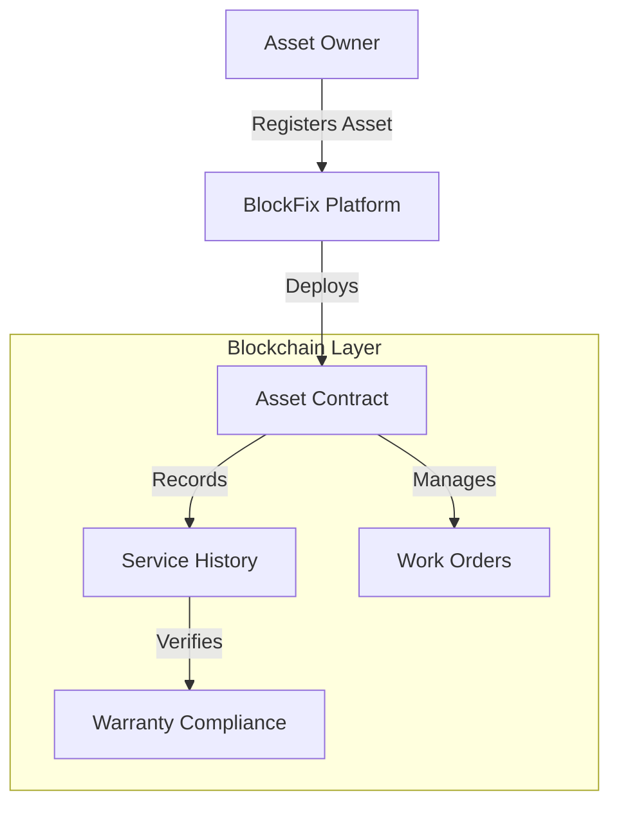
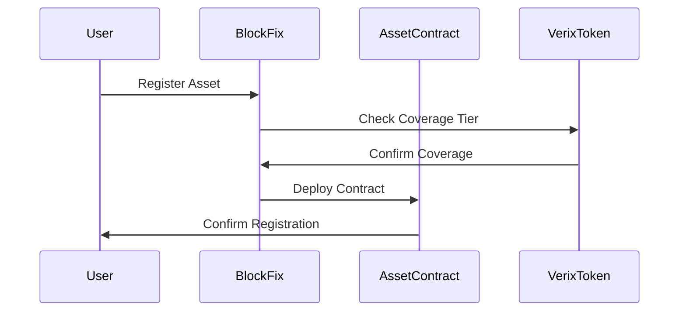

# Verix Token Whitepaper
## Blockchain-Powered Asset Management and Gas Fee Optimization

**Version 1.0 - November 2024**

---

## Abstract

Verix Token (VRX) represents a groundbreaking integration of blockchain technology with industrial asset management through its native integration with the BlockFix platform. By combining innovative gas fee optimization with immutable asset service records, Verix creates a comprehensive solution for businesses to manage their physical assets while minimizing blockchain transaction costs. This whitepaper outlines the technical architecture, economic model, and practical implementation of the Verix ecosystem, demonstrating how it addresses critical challenges in both blockchain adoption and asset management.

## Table of Contents

1. [Introduction](#1-introduction)
2. [Market Analysis](#2-market-analysis)
3. [The Verix Solution](#3-the-verix-solution)
4. [BlockFix Integration](#4-blockfix-integration)
5. [Technical Architecture](#5-technical-architecture)
6. [Token Economics](#6-token-economics)
7. [Governance Model](#7-governance-model)
8. [Security Framework](#8-security-framework)
9. [Implementation Roadmap](#9-implementation-roadmap)
10. [Conclusion](#10-conclusion)

## 1. Introduction

### 1.1 Background

The intersection of blockchain technology and industrial asset management presents both significant opportunities and challenges. While blockchain offers unprecedented transparency and immutability for asset records, adoption barriers persist due to transaction costs and integration complexity. These challenges particularly affect industrial sectors where asset management and maintenance tracking are crucial for operational efficiency and value preservation.

### 1.2 Vision

Verix aims to bridge the gap between blockchain's potential and practical industrial applications by providing:
- Efficient gas fee management through a tiered coverage system
- Seamless integration with the BlockFix asset management platform
- Immutable service records for industrial assets
- Value preservation through verified maintenance history

### 1.3 Market Opportunity

The global asset management market exceeds $200 billion annually, with significant inefficiencies in:
- Maintenance tracking and verification
- Warranty compliance management
- Asset value preservation
- Service history documentation

## 2. Market Analysis

### 2.1 Current Challenges

#### Asset Management
- Fragmented maintenance records
- Manual warranty tracking
- Difficulty verifying service history
- Value depreciation due to poor documentation

#### Blockchain Implementation
- Unpredictable transaction costs
- Complex integration requirements
- Technical barriers to adoption
- Scalability concerns

### 2.2 Target Market

1. Primary Markets:
   - Industrial equipment manufacturers
   - Facility management companies
   - Asset-intensive industries
   - Maintenance service providers

2. Secondary Markets:
   - Insurance providers
   - Asset financiers
   - Secondary market traders
   - Warranty providers

## 3. The Verix Solution

### 3.1 Core Components

#### Gas Fee Coverage System
- Tiered structure based on VRX holdings:
  - Basic Tier (1,000 VRX): 50% coverage
  - Standard Tier (5,000 VRX): 75% coverage
  - Premium Tier (10,000 VRX): 100% coverage
- Automated tier adjustment
- Daily usage limits ensuring sustainability

#### Asset Management Integration
- Automated smart contract deployment
- Digital service record creation
- Warranty compliance tracking
- Value preservation mechanisms

### 3.2 Key Benefits

1. For Asset Owners:
   - Reduced transaction costs
   - Verifiable maintenance history
   - Automated warranty compliance
   - Enhanced asset value retention

2. For Service Providers:
   - Streamlined work order processing
   - Verified service records
   - Automated payment systems
   - Enhanced credibility

## 4. BlockFix Integration

### 4.1 Technical Implementation

#### Smart Contract Architecture


#### Contract Functionality
1. Asset Registration
   - Unique contract deployment
   - Manufacturer specifications
   - Warranty terms
   - Maintenance requirements

2. Service Recording
   - Work order creation
   - Service verification
   - Parts tracking
   - Compliance checking

### 4.2 Operational Flow

1. Asset Registration
   ```solidity
   function registerAsset(
       string memory assetId,
       AssetDetails memory details,
       WarrantyTerms memory warranty
   ) external returns (address assetContract);
   ```

2. Work Order Management
   ```solidity
   function createWorkOrder(
       address assetContract,
       WorkOrderDetails memory details
   ) external returns (uint256 orderId);
   ```

3. Service Verification
   ```solidity
   function verifyService(
       uint256 orderId,
       bytes memory serviceProof
   ) external returns (bool);
   ```

## 5. Technical Architecture

### 5.1 Smart Contract System

#### Core Contracts
1. VerixToken Contract
   - ERC-20 implementation
   - Gas fee coverage logic
   - Governance functionality

2. GasPool Contract
   - Fee calculation
   - Coverage distribution
   - Balance management

3. Asset Management Contracts
   - Asset registration
   - Service record management
   - Warranty tracking

### 5.2 Integration Architecture



## 6. Token Economics

### 6.1 Token Distribution

Total Supply: 100,000,000 VRX
- Public Sale: 40,000,000 VRX (40%)
- Ecosystem Development: 25,000,000 VRX (25%)
- Team and Advisors: 15,000,000 VRX (15%)
- Treasury: 10,000,000 VRX (10%)
- Community Rewards: 10,000,000 VRX (10%)

### 6.2 Token Utility

1. Gas Fee Coverage
   - Tiered benefits system
   - Automated coverage calculation
   - Usage tracking and limits

2. Platform Access
   - Service registration
   - Contract deployment
   - Premium features

3. Governance Rights
   - Proposal submission
   - Voting power
   - Parameter adjustment

### 6.3 Economic Sustainability

1. Revenue Sources
   - Platform fees
   - Premium services
   - Integration licensing
   - Data access fees

2. Token Value Drivers
   - Utility demand
   - Coverage benefits
   - Governance rights
   - Ecosystem growth

## 7. Governance Model

### 7.1 Framework

#### Voting Mechanism
- 1 VRX = 1 Vote
- Minimum holding period: 7 days
- Proposal threshold: 100,000 VRX
- Voting period: 3 days
- Time-lock: 24 hours

#### Decision Scope
1. Technical Parameters
   - Gas coverage rates
   - Tier thresholds
   - Usage limits

2. Platform Development
   - Feature priorities
   - Integration approvals
   - Protocol upgrades

## 8. Security Framework

### 8.1 Smart Contract Security

1. Audit Process
   - Multiple independent audits
   - Formal verification
   - Penetration testing
   - Continuous monitoring

2. Risk Mitigation
   - Emergency pause functionality
   - Rate limiting
   - Access controls
   - Multi-signature requirements

### 8.2 Operational Security

1. Platform Security
   - Role-based access
   - Data encryption
   - Audit logging
   - Backup systems

2. Integration Security
   - API authentication
   - Rate limiting
   - Data validation
   - Error handling

## 9. Implementation Roadmap

### Phase 1: Foundation (Q4 2024)
- Smart contract deployment
- BlockFix integration
- Initial security audits
- Community building

### Phase 2: Growth (Q1 2025)
- Public token sale
- Platform launch
- Partnership expansion
- Feature enhancement

### Phase 3: Expansion (Q2-Q3 2025)
- Additional integrations
- Advanced features
- Market expansion
- Ecosystem development

### Phase 4: Maturity (Q4 2025+)
- Full decentralization
- Cross-chain support
- Enterprise solutions
- Global scaling

## 10. Conclusion

The Verix Token and BlockFix integration represents a significant advancement in blockchain-based asset management. By combining efficient gas fee coverage with robust asset tracking capabilities, Verix creates a comprehensive solution for businesses seeking to leverage blockchain technology while managing operational costs effectively.

## Legal Disclaimer

This whitepaper ("Whitepaper") is for informational purposes only and may be subject to change. Verix does not make any representation or warranty as to the accuracy or completeness of the information contained within this Whitepaper. This Whitepaper does not constitute any offer, solicitation of an offer, or any indication of trading intent for Verix tokens or any related securities in any jurisdiction.

The Verix token (VRX) is a utility token designed for use within the Verix ecosystem and does not represent any ownership rights, profit sharing arrangements, or rights to dividends. Any forward-looking statements in this Whitepaper reflect current views with respect to future events and are subject to risks, uncertainties, and assumptions.

© 2024 Verix. All rights reserved.
